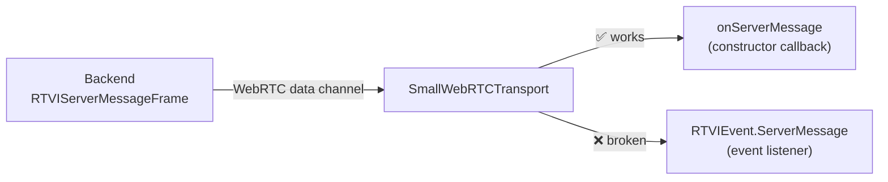

# pipecat-rtvi-frontend-toolkit

Frontend visualization tests, recipes, and component gallery for Pipecat RTVI.

Pipecat's RTVI frontend stack is rich: 4 visualizers, 13 event channels, multi-layer state management. This repo brings it all together with tests, practical tutorials, and a visual showcase.

## Planned

**Tests**: Visual regression and E2E tests for RTVI frontend components.

**Cookbook**: Recipes for wiring RTVI channels to custom UIs: building visualizers, handling ServerMessage, conversation displays, interruption timing, function call lifecycle.

**Component Zoo**: Side-by-side gallery of RTVI visualizers and UI patterns with configuration playgrounds.

## Known glitch: RTVIEvent.ServerMessage with SmallWebRTCTransport

`client.on(RTVIEvent.ServerMessage, handler)` **never fires** with SmallWebRTCTransport. The message arrives on the data channel but the event dispatch path is broken for this specific event type. The workaround is to use the `onServerMessage` callback in the `PipecatClient` constructor options, which bypasses the event emitter and gets called directly by the transport layer.
